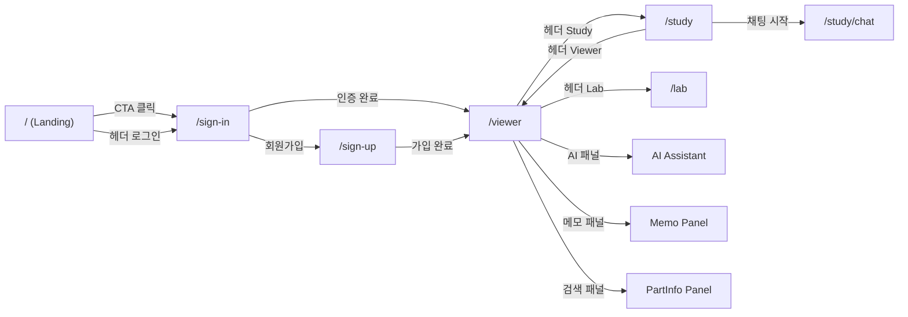
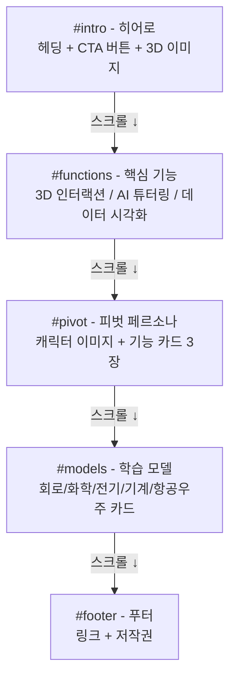
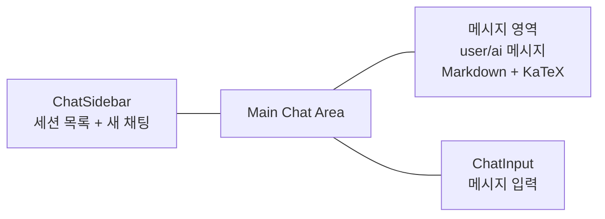
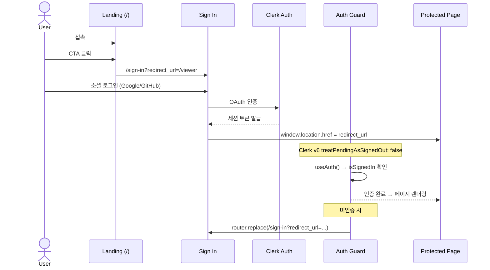
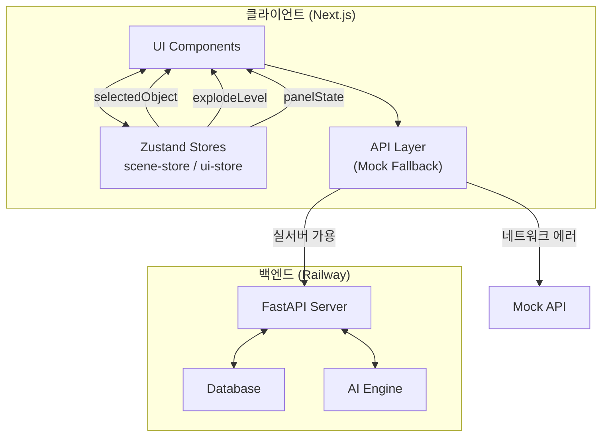

# SIMVEX - 사용자 시나리오 & UX 플로우

## 1. 프로젝트 개요

**SIMVEX**는 복잡한 공학 시스템을 **3D 인터랙션**과 **AI 튜터**로 학습할 수 있는 몰입형 교육 플랫폼입니다.

| 항목        | 내용                                                    |
| ----------- | ------------------------------------------------------- |
| 대상 사용자 | 공학 전공 대학생, 기계/전기/화학공학 학습자             |
| 핵심 가치   | 이론 → 실감형 3D 체험 → AI 기반 맞춤 학습               |
| 기술 스택   | Next.js 16 + React 19 + Three.js + Zustand + Clerk Auth |
| 배포        | Vercel (simvex-3rd.vercel.app)                          |

---

## 2. 사용자 페르소나

### 김민수 (22세, 가명)

| 항목           | 내용                                                                                                                                                  |
| -------------- | ----------------------------------------------------------------------------------------------------------------------------------------------------- |
| **직업**       | 기계공학과 2학년 학부생                                                                                                                               |
| **경험**       | 전공 수업에서 2D 도면만 보고 엔진의 내부 구조를 이해하려다 한계를 느낌                                                                                |
| **Pain Point** | "책에 나온 단면도만으로는 부품들이 어떻게 맞물려 돌아가는지 입체적으로 상상하기 너무 힘들어요."                                                       |
| **상황**       | 전공 과목 '기계요소설계' 중간고사 과제로 **'판스프링의 적층 구조와 응력 분산 원리'**에 대한 분석 레포트를 제출해야 함                                 |
| **목표**       | 단순한 쇠막대기처럼 보이는 판스프링이 어떻게 여러 겹의 판으로 구성되어 하중을 견디는지, 그 내부 결합 방식을 직관적으로 파악하여 학습 효율을 높이는 것 |

---

## 3. 주요 사용자 시나리오

### 시나리오: 판스프링 구조 분석 학습

> **김민수**가 SIMVEX를 활용하여 판스프링의 적층 구조를 3D로 탐색하고, AI 가이드 '피봇'의 도움을 받아 과제를 완성한다.

#### Step 1. SIMVEX 접속 및 탐색

| 단계 | 사용자 행동                                    | 시스템 반응                      | 화면                |
| ---- | ---------------------------------------------- | -------------------------------- | ------------------- |
| 1-1  | SIMVEX 웹사이트 접속                           | 랜딩 페이지 풀페이지 스크롤 표시 | `/`                 |
| 1-2  | "지금 바로 학습 시작하기" CTA 클릭             | 로그인 페이지로 이동             | `/sign-in`          |
| 1-3  | 소셜 로그인 (Google/GitHub)                    | 인증 완료 → Viewer로 리다이렉트  | `/viewer`           |
| 1-4  | 모델 목록에서 **'Leaf Spring(판스프링)'** 선택 | OBJ 파일 로드, 자동 카메라 피팅  | `/viewer?modelId=7` |
| 1-5  | 마우스로 모델 회전/줌하며 외관 관찰            | OrbitControls로 자유 시점 조작   | `/viewer`           |

#### Step 2. 구조 분해 (Explode View)

| 단계 | 사용자 행동                                                                           | 시스템 반응                                   | 화면                 |
| ---- | ------------------------------------------------------------------------------------- | --------------------------------------------- | -------------------- |
| 2-1  | 하단 Explode 슬라이더를 오른쪽으로 이동                                               | 겹겹이 쌓인 리프(Leaf)들이 수직으로 분해      | `/viewer`            |
| 2-2  | 리프 사이에 있는 작은 부품 발견                                                       | 부품 클릭 시 하이라이트(cyan) + PartInfo 표시 | `/viewer` (PartInfo) |
| 2-3  | 각 부품(Leaf-Layer, Clamp-Center, Support-Chassis, Support-Rubber) 클릭하며 구조 파악 | 부품별 이름, 재질, 설명 표시                  | `/viewer` (PartInfo) |

#### Step 3. 피봇(AI 가이드)에게 질문

| 단계 | 사용자 행동                                                               | 시스템 반응                                                                                               | 화면                 |
| ---- | ------------------------------------------------------------------------- | --------------------------------------------------------------------------------------------------------- | -------------------- |
| 3-1  | 사이드 툴바에서 AI 아이콘 클릭                                            | AI Assistant 드래그 가능 패널 열림                                                                        | `/viewer` (AI Panel) |
| 3-2  | "피봇, 리프 사이에 끼워진 이 얇은 패드는 뭐야? 없어도 되는 거 아냐?" 입력 | SSE 스트리밍으로 피봇이 실시간 답변                                                                       | `/viewer` (AI Panel) |
| 3-3  | 피봇 답변 확인                                                            | "그건 **'사일런서 패드'**야! 리프끼리 직접 부딪혀서 소음이 나거나 마모되는 걸 막아주는 중요한 역할을 해." | `/viewer` (AI Panel) |
| 3-4  | 추가 질문: "판스프링의 응력 분산 원리를 수식으로 설명해줘"                | KaTeX 수식 렌더링 + Markdown 포맷으로 응답                                                                | `/viewer` (AI Panel) |

#### Step 4. 메모 작성 및 학습 정리

| 단계 | 사용자 행동                                                         | 시스템 반응                          | 화면                   |
| ---- | ------------------------------------------------------------------- | ------------------------------------ | ---------------------- |
| 4-1  | 사이드 툴바에서 메모 아이콘 클릭                                    | Memo 드래그 가능 패널 열림           | `/viewer` (Memo Panel) |
| 4-2  | 새롭게 알게 된 '사일런서 패드'의 역할과 판스프링 조립 순서를 타이핑 | 메모 자동 저장 (API)                 | `/viewer` (Memo Panel) |
| 4-3  | Study 대시보드로 이동                                               | 헤더 "Study" 클릭                    | `/study`               |
| 4-4  | 퀵액션 "PDF 리포트 출력" 클릭                                       | AI가 학습 내용 기반 레포트 요약 생성 | `/study/chat`          |

#### Step 5. 학습 마무리

| 단계 | 사용자 행동                                     | 시스템 반응                           | 화면          |
| ---- | ----------------------------------------------- | ------------------------------------- | ------------- |
| 5-1  | 메모와 AI 응답을 바탕으로 레포트 핵심 요약 정리 | 과거 채팅 세션 사이드바에서 조회 가능 | `/study/chat` |
| 5-2  | 과제 준비 완료, 로그아웃                        | 세션 종료                             | -             |

### 기대효과

| 효과                 | 설명                                                                                   |
| -------------------- | -------------------------------------------------------------------------------------- |
| **학습 효율 극대화** | 모르는 지점이 생겼을 때 이탈하지 않고, 즉시 AI 가이드 '피봇'에게 해결책을 얻음         |
| **지식의 자산화**    | 단순히 눈으로 보는 것에 그치지 않고, 메모 기능을 통해 학습 내용을 자기 것으로 내재화함 |
| **몰입도 향상**      | 캐릭터와의 대화 및 직접 조작하는 인터랙션을 통해 학습 몰입도 향상                      |

---

### 보조 시나리오: 비로그인 사용자 접근 차단

> 비로그인 사용자가 직접 URL로 보호된 페이지에 접근을 시도한다.

| 단계 | 사용자 행동             | 시스템 반응                                     | 화면       |
| ---- | ----------------------- | ----------------------------------------------- | ---------- |
| 1    | `/viewer` URL 직접 입력 | Auth Guard가 로그인 상태 확인                   | -          |
| 2    | 미로그인 감지           | `/sign-in?redirect_url=/viewer`로 리다이렉트    | `/sign-in` |
| 3    | 로그인 완료             | `redirect_url` 파라미터 기반 원래 페이지로 이동 | `/viewer`  |

---

## 4. 요구사항 구현 결과

### 필수 요건

| #   | 요구사항                                                                           | 구현 상태     | 구현 내용                                                                                                                                                                                                        | 관련 파일                                                                                                                                                              |
| --- | ---------------------------------------------------------------------------------- | ------------- | ---------------------------------------------------------------------------------------------------------------------------------------------------------------------------------------------------------------- | ---------------------------------------------------------------------------------------------------------------------------------------------------------------------- |
| 1   | **학습 기계/장비 조회** — 학습할 3D 오브젝트 선택 (4~7개 리스트)                   | **구현 완료** | 7개 모델 리스트 제공 (V4 Engine, Robot Arm, Machine Vice, Drone, Robot Gripper, Suspension, Leaf Spring). 랜딩 페이지 모델 카드 + Viewer에서 모델 전환                                                           | `src/lib/api/mock.ts` (모델 데이터), `src/components/sections/landing-study-model-section.tsx` (카드 UI), `src/app/viewer/page.tsx` (`?modelId=N` 파라미터)            |
| 2   | **3D 모델 출력** — 3D 모델 뷰포트 출력, 조명/광택 셰이더                           | **구현 완료** | OBJLoader로 .obj 파일 로딩. MeshStandardMaterial (metalness 0.3, roughness 0.7) 적용. 3점 조명 (ambient + directional + fill)                                                                                    | `src/components/viewer/ModelOBJ.tsx` (모델 로딩), `src/components/viewer/SceneCanvas.tsx` (Canvas + 조명)                                                              |
| 3   | **3D 오브젝트 배치 및 인터랙션** — 회전, 줌 인/아웃, 부품 조립도 배치              | **구현 완료** | OrbitControls (마우스 드래그 회전 + 스크롤 줌). 부품별 로컬 좌표 초기 위치 저장. 모델 로드 시 자동 스케일/센터링 + 카메라 3/4 뷰 자동 피팅                                                                       | `src/components/viewer/ModelOBJ.tsx` (인터랙션), `src/components/viewer/SceneCanvas.tsx` (OrbitControls)                                                               |
| 4   | **분해/조립 조절 GUI + 완제품 정보 설명** — Explode 슬라이더 + 구조/이론 설명 패널 | **구현 완료** | Explode 슬라이더 (0~1) → 부품이 모델 중심에서 방사형으로 분리되는 lerp 애니메이션. PartInfo 패널에서 완제품/부품별 설명 표시                                                                                     | `src/components/viewer/ViewerZoomSlider.tsx` (슬라이더), `src/components/viewer/ModelOBJ.tsx` (분해 애니메이션), `src/components/panels/PartInfoPanel.tsx` (설명 패널) |
| 5   | **부품 정보 조회** — 부품 선택 시 부품명, 역할, 재질 정보 제공                     | **구현 완료** | 부품 클릭 → cyan 하이라이트 (emissive) + PartInfo 자동 표시. 부품명, 설명(description), 재질(material), 메타데이터(weight, dimensions 등) 표시. 빈 공간 클릭 시 선택 해제                                        | `src/components/viewer/ModelOBJ.tsx` (클릭/선택), `src/components/panels/PartInfoPanel.tsx` (정보 표시), `src/lib/api/mock.ts` (부품 데이터)                           |
| 6   | **사용자 데이터 저장** — 뷰/분해도/줌 값 손실 방지 (리프레싱 방지)                 | **구현 완료** | Zustand + `persist` 미들웨어 → localStorage에 JSON 직렬화 저장. scene-store: 카메라 위치/회전/타겟, 선택 객체, explode level, 모델 ID. ui-store: 패널 열림 상태, 와이어프레임 모드. 페이지 새로고침 시 자동 복원 | `src/stores/scene-store.ts` (`simvex-scene-storage`), `src/stores/ui-store.ts` (`simvex-ui-storage`), `src/hooks/use-store-hydration.ts` (SSR 하이드레이션)            |
| 7   | **측면 서브 노트(메모장)** — 학습 보조용 노트 패널                                 | **구현 완료** | 사이드 툴바 메모 아이콘 → 드래그 가능한 Memo 패널 (360x300). 텍스트 입력 → API로 모델/부품별 저장. 패널 인/아웃 토글                                                                                             | `src/components/panels/NotesPanel.tsx` (메모 UI), `src/components/viewer/DraggablePanel.tsx` (드래그 패널), `src/components/viewer/ViewerSideToolbar.tsx` (토글 버튼)  |
| 8   | **서브 AI 어시스턴트** — 학습 보조 AI, 3D 완제품별 질문                            | **구현 완료** | 사이드 툴바 AI 아이콘 → AI Assistant 드래그 패널 (400x600). SSE 스트리밍 실시간 응답. Markdown + KaTeX 수식 + 코드 하이라이팅 렌더링. 모델별 컨텍스트 연동. 세션 기반 대화 이력 관리                             | `src/components/panels/ChatInterface.tsx` (채팅 UI), `src/hooks/use-chat-session.ts` (세션 관리), `src/components/panels/ChatMessage.tsx` (메시지 렌더링)              |

### 추가 요건

| #   | 요구사항                                          | 구현 상태     | 구현 내용                                                                                                                                            | 관련 파일                                                                          |
| --- | ------------------------------------------------- | ------------- | ---------------------------------------------------------------------------------------------------------------------------------------------------- | ---------------------------------------------------------------------------------- |
| 1   | **퀴즈** — 학습 이해도 확인 퀴즈                  | **구현 완료** | QuizPanel 컴포넌트: 객관식 문제 출제, 선택지 클릭 → 제출 → 정답/오답 피드백. Study 대시보드에서 퀵액션 "학습 내용 바탕의 퀴즈"로 AI 기반 퀴즈 생성   | `src/components/panels/QuizPanel.tsx` (퀴즈 UI), `src/app/study/page.tsx` (퀵액션) |
| 2   | **워크플로우 차트** — 노드 기반 플로우 차트       | **미구현**    | Lab 페이지에서 개발 예정으로 표시 중                                                                                                                 | `src/app/lab/page.tsx` (placeholder)                                               |
| 3   | **PDF 출력** — 3D 뷰어 캡처 + 노트/AI 대화 문서화 | **구현 완료** | html2canvas로 현재 3D Canvas 스크린샷 캡처 → jsPDF로 A4 landscape PDF 생성. 상단: 뷰어 이미지, 하단: 학습 노트 내용 포함. 날짜 기반 파일명 자동 생성 | `src/lib/pdf-export.ts` (PDF 생성), `src/app/study/page.tsx` (퀵액션 연동)         |

### 핵심 로직 및 예외 처리

| 항목                 | 구현 내용                                                                                                                                                                                  |
| -------------------- | ------------------------------------------------------------------------------------------------------------------------------------------------------------------------------------------ |
| **인증/보호 라우트** | Clerk v6 소셜 로그인 (Google/GitHub). `/viewer`, `/study`, `/study/chat`, `/lab` 접근 시 Auth Guard 자동 리다이렉트. `treatPendingAsSignedOut: false`로 Clerk v6 pending session 이슈 해결 |
| **API 장애 대응**    | `withMockFallback()` 패턴: 백엔드 네트워크 에러 시 자동으로 Mock API 폴백. 서버 에러(4xx/5xx)는 그대로 전달, 연결 실패만 폴백                                                              |
| **3D 메모리 관리**   | 모델 교체/언마운트 시 geometry.dispose() + material.dispose() + texture.dispose() 자동 실행. VRAM 누수 방지                                                                                |
| **CSS Zoom 보정**    | 1440px 이하 뷰포트에서 body zoom: 0.75 자동 스케일링. Three.js Canvas는 `max-[1919px]:scale-[1.3333]` 조건부 보정으로 좌표계 일치                                                          |
| **SSR 하이드레이션** | Zustand persist 스토어의 SSR/CSR 불일치 방지. `useStoreHydration` 훅으로 하이드레이션 완료 후 렌더링                                                                                       |
| **XSS 방지**         | DOMPurify로 사용자 입력 sanitize. Zod 스키마 기반 입력 검증 (채팅 메시지, 노트 내용, 모델 ID)                                                                                              |

---

## 5. 화면별 UX 플로우

### 4.1 전체 네비게이션 구조



### 4.2 랜딩 페이지 (`/`)

**풀페이지 스크롤 (5 섹션)**



**인터랙션:**

- 마우스 휠, 터치 스와이프, 키보드 (↑↓, PageUp/Down, Home/End) 지원
- 섹션 전환 시 easeOutExpo 이징 (1.4초)
- 각 섹션 IntersectionObserver 기반 fade-in 애니메이션

### 4.3 3D 뷰어 (`/viewer`)

**레이아웃 구조:**

```
┌─────────────────────────────────────────────────┐
│  ViewerHeader (Logo + Nav + User)               │
├─────────────────────────────────────────────────┤
│                                          [Side] │
│         ViewerToolbar (top center)        Tool  │
│                                          bar    │
│              3D Canvas (fullscreen)             │
│              - OBJ Model Loading                │
│              - OrbitControls                     │
│              - Click Select                      │
│              - Explode Animation                 │
│                                                 │
│         ViewerZoomSlider (bottom center)        │
├─────────────────────────────────────────────────┤
│  Draggable Panels:                              │
│  - AI Assistant (400×600)                       │
│  - PartInfo (380×500)                           │
│  - Memo/Notes (360×300)                         │
└─────────────────────────────────────────────────┘
```

**3D 인터랙션:**

- **회전/줌**: OrbitControls (마우스 드래그 + 휠)
- **부품 선택**: 클릭 → 하이라이트 (cyan emissive) + PartInfo 자동 표시
- **부품 해제**: 빈 공간 클릭 → 선택 해제
- **분해 뷰**: Explode 슬라이더 (0~1) → 부품이 중심에서 방사형 분리
- **와이어프레임**: 토글 버튼으로 와이어프레임 모드 전환
- **카메라 자동 피팅**: 모델 로드 시 3/4 뷰로 자동 정렬

### 4.4 Study 대시보드 (`/study`)

**2컬럼 레이아웃:**

```
┌─────────────────────────────────────────────────┐
│  ViewerHeader                                   │
├──────────────────────┬──────────────────────────┤
│  AI Chat (55%)       │  Memo (45% top)          │
│  ┌────────────────┐  │  ┌──────────────────┐    │
│  │ 캐릭터 + 인사  │  │  │ 메모 카드 3개    │    │
│  │ 채팅 입력      │  │  └──────────────────┘    │
│  │ 퀵액션 칩 4개  │  │                          │
│  └────────────────┘  │  AI Quiz (45% bottom)    │
│                      │  ┌──────────────────┐    │
│                      │  │ 퀴즈 영역        │    │
│                      │  └──────────────────┘    │
└──────────────────────┴──────────────────────────┘
```

**퀵액션:**

- 학습에 관한 도움받기
- 학습 내용 바탕의 퀴즈
- 부품 정보 불러오기
- PDF 리포트 출력

### 4.5 AI 채팅 (`/study/chat`)



**기능:**

- SSE 스트리밍 응답 (실시간 타이핑 효과)
- Markdown 렌더링 (GFM + 수식 + 코드 하이라이팅)
- 세션 관리 (생성, 전환, 삭제)
- URL 쿼리 파라미터 (`?sessionId=X&q=message`)

---

## 5. 인증 플로우



**보호된 라우트:** `/viewer`, `/study`, `/study/chat`, `/lab`

---

## 6. 데이터 플로우



**API 분기 로직:**

- `models`: 항상 Mock API (로컬 OBJ 파일 사용)
- `chat`, `notes`, `auth`: 실서버 우선 → 네트워크 에러 시 Mock 폴백

---

## 7. 기술 스택 매핑

| 기능            | 기술                         | 용도                      |
| --------------- | ---------------------------- | ------------------------- |
| 프레임워크      | Next.js 16 (App Router)      | SSR/SSG, 라우팅           |
| 3D 렌더링       | Three.js + React Three Fiber | OBJ 모델 로딩, 인터랙션   |
| 상태 관리       | Zustand (persist)            | 씬/UI 상태, 로컬 스토리지 |
| 인증            | Clerk v6                     | 소셜 로그인, 세션 관리    |
| 스타일링        | Tailwind CSS v4              | 유틸리티 기반 CSS         |
| 애니메이션      | Motion (Framer Motion)       | 패널 전환, 페이드 인      |
| AI 채팅         | SSE Streaming                | 실시간 응답               |
| 수식 렌더링     | KaTeX + rehype-katex         | 수학 수식 표시            |
| 코드 하이라이팅 | highlight.js                 | 코드 블록                 |
| Markdown        | react-markdown + remark-gfm  | 채팅 메시지 포맷          |
| 배포            | Vercel + Git LFS             | 정적 에셋 + 3D 모델       |

---

## 8. 3D 모델 목록

| ID  | 모델명        | 분야       | 파일                      | 부품 수 |
| --- | ------------- | ---------- | ------------------------- | ------- |
| 1   | V4 Engine     | 기계공학   | v4-engine.obj (16MB)      | 4       |
| 2   | Robot Arm     | 로보틱스   | robot-arm.obj (6.4MB)     | 2       |
| 3   | Machine Vice  | 기계공학   | machine-vice.obj (1MB)    | 5       |
| 4   | Drone         | 항공우주   | drone.obj (9.2MB)         | 5       |
| 5   | Robot Gripper | 로보틱스   | robot-gripper.obj (7.2MB) | 4       |
| 6   | Suspension    | 자동차공학 | suspension.obj (4.3MB)    | 4       |
| 7   | Leaf Spring   | 자동차공학 | leaf-spring.obj (3.8MB)   | 4       |

---

## 9. 핵심 화면 요약

| 화면             | 경로          | 인증     | 설명                                |
| ---------------- | ------------- | -------- | ----------------------------------- |
| 랜딩             | `/`           | 불필요   | 풀페이지 스크롤, CTA                |
| 로그인           | `/sign-in`    | 불필요   | Clerk 소셜 로그인                   |
| 회원가입         | `/sign-up`    | 불필요   | Clerk 회원가입                      |
| 3D 뷰어          | `/viewer`     | **필수** | 3D 모델 탐색, AI/메모/부품정보 패널 |
| Study 대시보드   | `/study`      | **필수** | AI 채팅 + 메모 + 퀴즈               |
| AI 채팅          | `/study/chat` | **필수** | 전체화면 AI 대화                    |
| Lab              | `/lab`        | **필수** | 실험실 (개발 예정)                  |
| 개인정보처리방침 | `/privacy`    | 불필요   | 정적 페이지                         |
| 이용약관         | `/terms`      | 불필요   | 정적 페이지                         |
